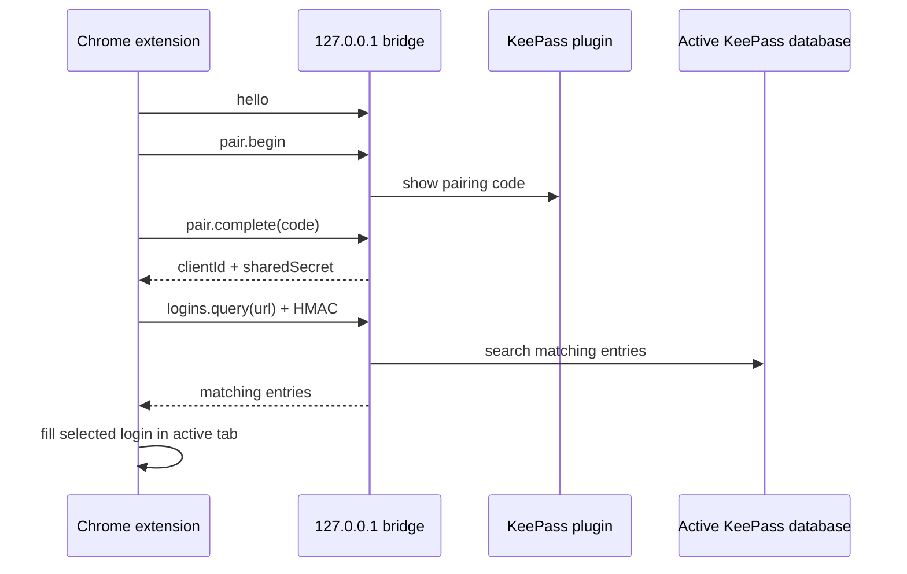

# Architecture

KeePassBrowserBridge is split into two deliverables:

- A KeePass 2.x plugin that exposes a local loopback JSON bridge.
- A Chrome MV3 extension that pairs with the plugin and fills selected credentials into the active tab.

## Runtime flow

## Trust boundary

The bridge listens only on `127.0.0.1`. Browser clients must pair before privileged methods are accepted. After pairing, requests include an HMAC signature over the protocol version, method, request id, timestamp, origin, client id, and payload.

The Chrome extension stores the generated client id and shared secret in `chrome.storage.local`.

## MVP scope

The MVP supports:

- Local pairing from Chrome to KeePass.
- Querying credentials from the active KeePass database by URL host.
- Filling the selected username and password into the current Chrome tab.
- Local verification scripts and GitHub workflows for repeatable checks.

Known limitations before a broader release:

- Browser client trust persistence in the KeePass plugin must be verified across KeePass restarts.
- Manual smoke testing is still required on real login pages because form structures vary by site.
- The Chrome extension is packaged as an unpacked/developer extension ZIP until Chrome Web Store packaging is introduced.
