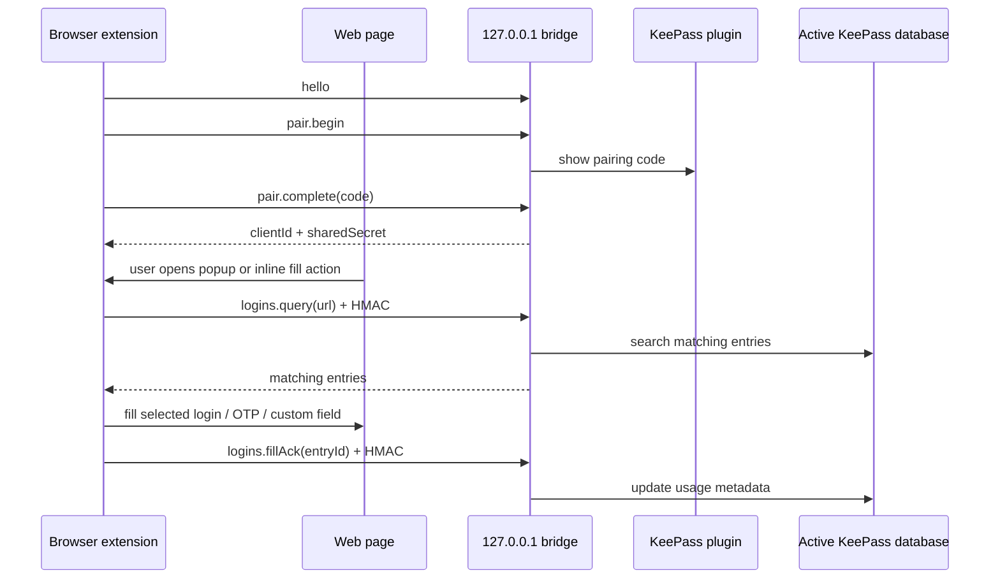
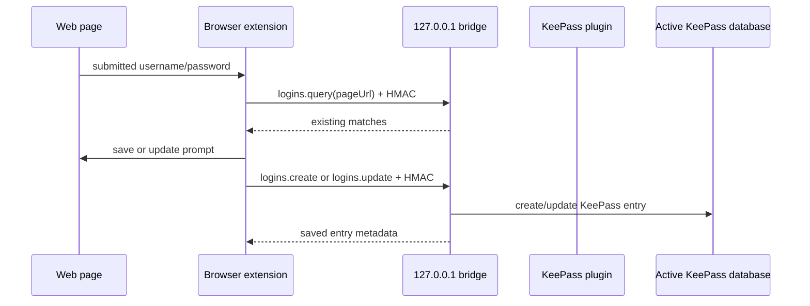

# Architecture

KeePass Browser Bridge is split into two release deliverables:

- A KeePass 2.x plugin that owns all database reads/writes and exposes a loopback-only JSON bridge.
- Browser extension packages for Chrome-family browsers and Firefox.

The browser extension never reads `.kdbx` files directly and never stores the KeePass master key.

## Runtime Flow

Save and update flows use the same authenticated bridge after the content script detects a submitted login or changed password:

## Trust Boundary

The bridge listens only on `127.0.0.1`. Web origins are rejected before request handling. Extension origins must match `chrome-extension://<id>` or `moz-extension://<guid>`. Bridge calls use JSON `POST /bridge` requests, are capped at 256 KiB, and any HTTP `Origin` header must match the protocol request origin.

After pairing, privileged requests include an HMAC-SHA256 signature over protocol version, method, request ID, timestamp, origin, client ID, and payload. The bridge rejects stale timestamps, replayed request IDs, revoked clients, wrong origins, and clients without the required permission.

## Protocol Areas

| Area | Methods |
| --- | --- |
| Availability | `hello` |
| Pairing | `pair.begin`, `pair.complete`, `pair.cancel` |
| Trusted browsers | `client.status`, `clients.list`, `clients.revoke`, `clients.updatePermissions` |
| Credentials | `logins.query`, `logins.create`, `logins.update`, `logins.fillAck` |

The current protocol covers passwords, TOTP codes, selected non-protected custom fields, trusted-browser permissions, trusted-browser last-used timestamps, and usage acknowledgements. `hello` now advertises the centralized supported-method list plus feature flags and status metadata so the extension can detect disabled capabilities without guessing from failures. Passkeys/WebAuthn are still disabled for browsers: reserved passkey method names and `passkeyRead`/`passkeyWrite` permission bits are present so the security gate can be tested, feature-gated trusted-browser passkey permission controls stay hidden while `hello` reports `passkeys=false` with `prototype_disabled` status, and the production handler returns `feature_disabled` until `docs/passkeys-webauthn-design.md` is completed. The backend prototype now includes passkey credential storage, lookup summaries, bridge-level list/create/get/cancel/revoke routing behind a test-enabled gate, KeePass approval grant/deny handling with a compiled approval dialog prototype, ES256 create-algorithm policy enforcement, invalid user-handle rejection before approval, create exclude-credential rejection, attestation-conveyance rejection beyond `none`, assertion signing, pending create/get session binding, browser timeout hints clamped to the backend pending-session maximum, requested `credProps` extension results for discoverable credentials, sign-count persistence, passkey deletion, and pending-session cleanup on browser cancellation, trusted-client revoke, plus KeePass database close events. A non-packaged Chrome proxy experiment covers request serialization, create/get timeout hint forwarding, create `credProps` request/result mapping, response completion serialization, injected bridge begin/complete/cancel handlers with `approveCreate` and `chooseCredential` hooks, attach/detach lifecycle, UVPAA completion, cancellation handling, and fail-closed trusted-origin resolution from browser-supplied requestInfo or frame context, but it refuses to forward WebAuthn requests without trusted origin context, with invalid RP IDs, with invalid challenges, with invalid user handles, with unsupported required user verification, with create options that do not allow ES256, with unsupported attestation conveyance, or with duplicate pending request IDs.

## Data Model

KeePass Browser Bridge uses standard KeePass fields where possible:

- `Title`, `UserName`, `Password`, and `URL`.
- Additional URL fields named `URL (n)` for matching.
- TOTP fields named `otp`, `TOTP Seed`, `TOTP Secret`, `TOTP`, or `TimeOtp-Secret-Base32`.
- Non-reserved custom string fields.

Protected custom fields are redacted before they reach popup search, copy actions, focused-field fill, or settings export.

## Browser Surfaces

- Popup: pairing, status, query, search, fill, create, edit, trusted browsers, lock/unlock, site overrides, and About/update status.
- Content script: form detection, inline picker, save-new prompt, update-password prompt, username-first flow tracking, OTP fill, and focused-form targeting.
- Options page: global settings, site overrides, trusted browser management, settings import/export, bridge status, and About/update status.
- Background script: bridge transport, HMAC signing, pending credential storage, auto-lock, context menus, notifications, HTTP Basic Auth, and content-script mediation.

## Release Artifacts

Release builds produce:

- `KeePassBrowserBridge.dll`
- `KeePassBrowserBridge.plgx`
- `KeePassBrowserBridge-chrome-extension-<version>.zip`
- `KeePassBrowserBridge-firefox-extension-<version>.zip`
- `versioninfo.txt`
- `release-manifest.json`
- `SHA256SUMS.txt`
- Optional `*.asc` GPG detached signatures when maintainers build with `-SignArtifacts`.

`scripts/verify-release-artifacts.ps1` checks artifact versions, packaged file lists, browser manifests, release-manifest metadata, SHA-256 checksums, and GPG signatures when `-RequireSignatures` is used before publication.
